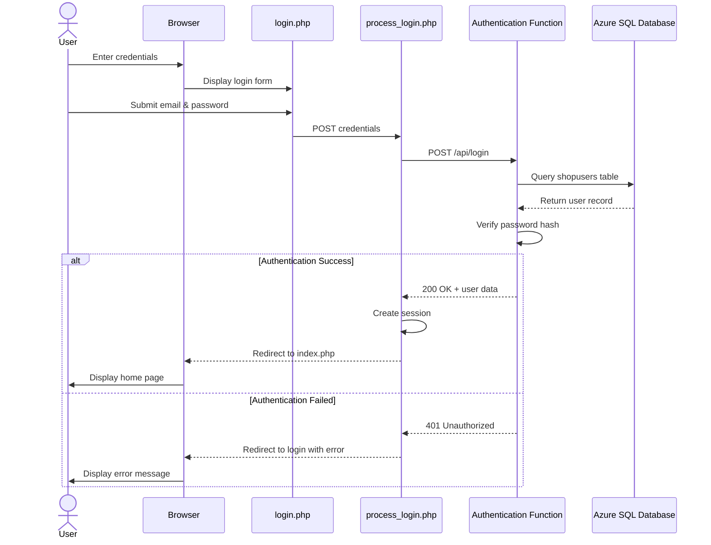
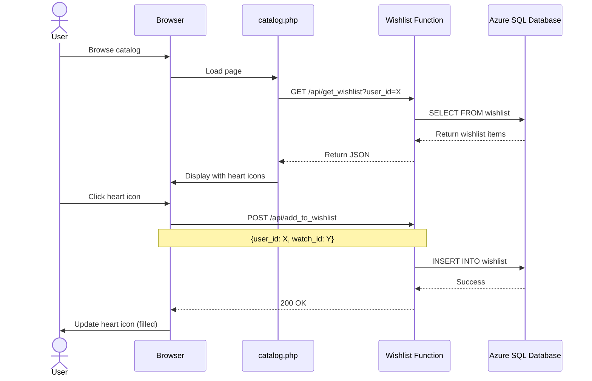
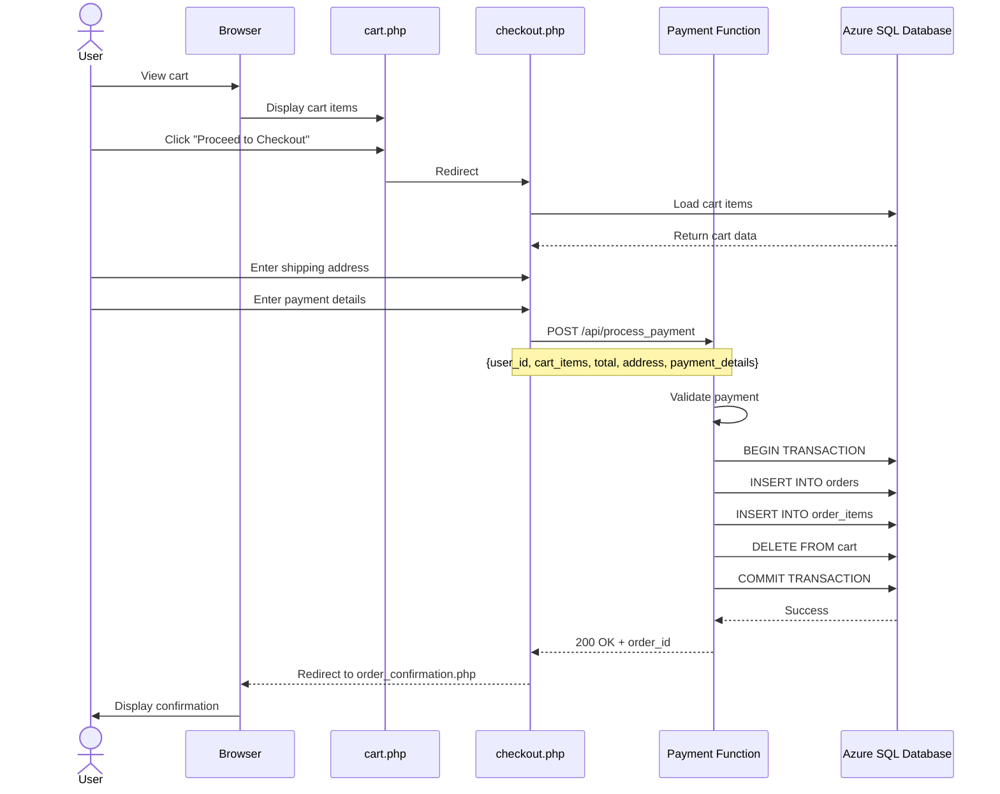
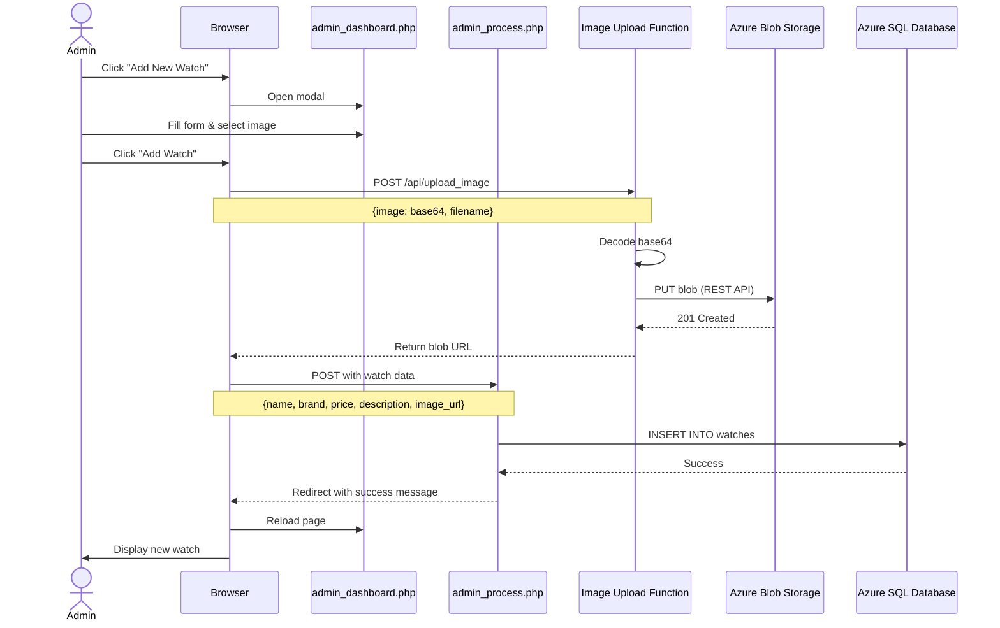

# ShopSphere - UML Architecture Diagrams

## 1. System Architecture Diagram

## 2. Database Schema (ER Diagram)

## 3. Component Diagram

## 4. Sequence Diagram - User Login Flow

## 5. Sequence Diagram - Add to Wishlist Flow

## 6. Sequence Diagram - Checkout & Payment Flow

## 7. Sequence Diagram - Admin Add Product Flow

## 8. Deployment Diagram

## 9. Class Diagram - PHP Application Structure

## 10. Use Case Diagram

## Architecture Summary

### Technology Stack
- **Frontend**: HTML5, CSS3, JavaScript (Vanilla)
- **Backend**: PHP 8.x with sqlsrv extension
- **Serverless**: Azure Functions (Python 3.12) with pyodbc
- **Database**: Azure SQL Database
- **Storage**: Azure Blob Storage
- **CI/CD**: GitHub Actions
- **Hosting**: Azure App Service (PHP) + Azure Functions

### Key Design Patterns
1. **MVC Pattern**: Separation of concerns in PHP application
2. **API Gateway Pattern**: Azure Functions as microservices
3. **Repository Pattern**: Database access abstraction
4. **Session-based Authentication**: PHP session management
5. **REST API**: Stateless communication between web app and functions

### Security Features
- SQL injection prevention (parameterized queries)
- Password hashing (bcrypt)
- Session management for authentication
- HTTPS encryption
- Azure SQL firewall rules
- CORS configuration on Functions

### Scalability Features
- Serverless Azure Functions (auto-scaling)
- Azure SQL Database (scalable tiers)
- Blob Storage for static assets
- Stateless API design
- Connection pooling
